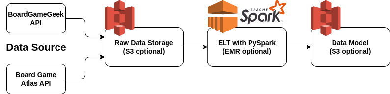
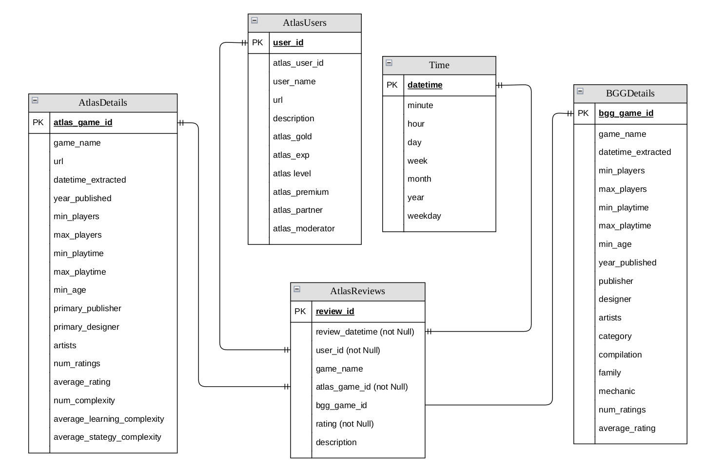
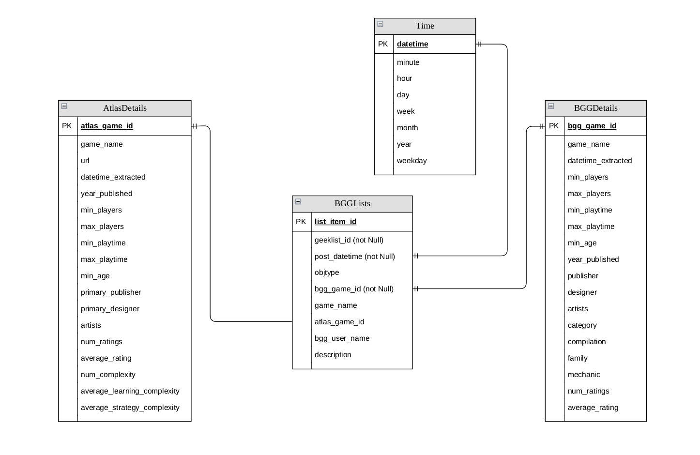
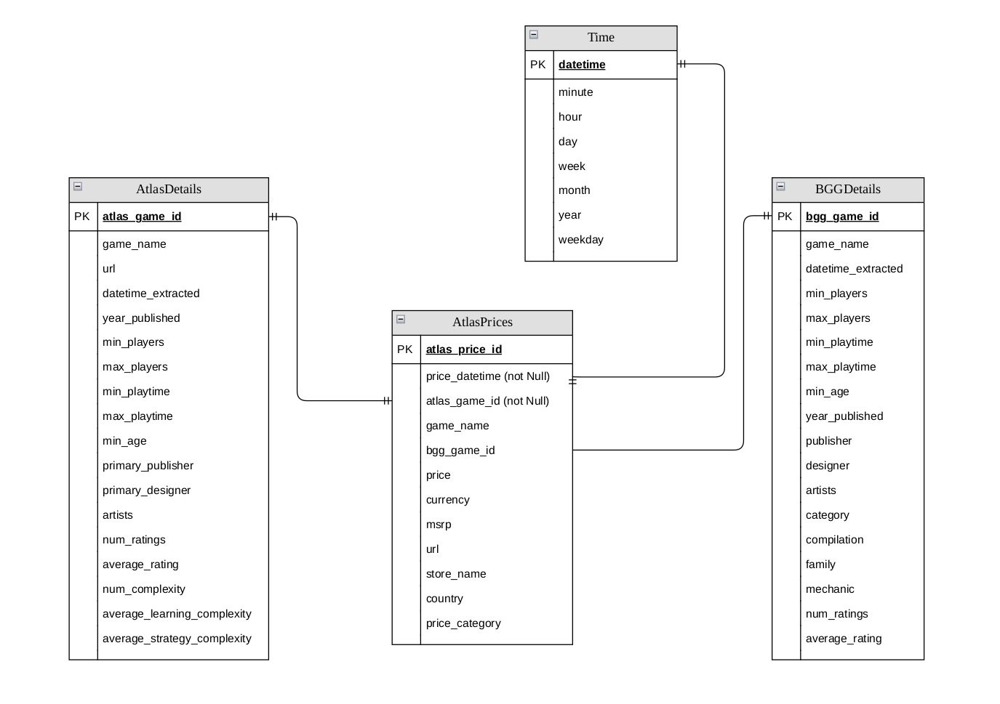

# Board Game Dataset Model

## Project Summary

The Board Game Dataset Model was completed as a learning project to brush up on data modelling and Spark skills and was completed along with the Udacity Data Engineering Degree.

The Board Game Dataset Model aims to support a hypothetical application where a developer could use the data to easily populate a user facing application using publicly available data. The data in the model is aggregated from two major board game data sources including [BoardGameGeek (BGG)](https://boardgamegeek.com/) and [Board Game Atlas](https://www.boardgameatlas.com/).

This project was inspired by a previous personal project: [Board Game Explorer Application](https://github.com/WraySmith/boardgame-explorer). The application used board game data queried from the BoardGameGeek API, but was limited in the data that was used. During the project it was realized that more could be accomplished (or more possibilities available) with a richer dataset including aggregating from more than one source. However, the focus of the previous project was building the application. This project aims to build the data models that would support having a richer data source for any future app development.

The general diagram for the project is shown below and the project files and star data models are discussed.

## Project Files

The following files/directories are available as part of the project:

- [EDA.ipynb](./EDA.ipynb) - EDA of the dataset including data pipelines for the data model
- [create_tables.py](./create_tables.py) - script that can be run to generate the data model
- [utils.py](./utils.py) - supporting function(s) for `create_tables.py`
- [upload_s3.py](./upload_s3.py) - script that can be run to transfer raw data to S3 if using EMR (the purpose of the script is for project setup, not as part of any automated/semi-automated data model process)
- [dl.cfg](./dl.cfg) - where config parameters can be stored
- [data/](./data/) - raw data used for the project as well as a data dictionary
- [data_access/](./data_access/) - details on the APIs used to access the data and associated scripts

## Dataset

The data used in this project is from the two sources noted below. There are approximately **1.136M** rows of data.

Scripts used to compile the data from the APIs can be found in this repository at `/data_access/`. Additional information on compiling the data is discussed in `/data_access/README.md/`. The resulting data is available at `/data/` and data dictionaries for data used in the model can be found at `/data/README.md`.

### BoardGameGeek

- ["GeekLists"](https://boardgamegeek.com/geeklists) provides lists of games that users rank in blogs ("Top 10 Games", "Most Innovative Games 2022", etc), this could be used as a proxy for a game trending if it has been mentioned in many recent GeekLists.
- Information on board games (min players, max players) are also available.

### Board Game Atlas

- Board Game Atlas scrapes various sites to compile board game [pricing](https://www.boardgameatlas.com/api/docs/prices), this can be used to assess board game price changes over time, or query the best price that has existed for a game.
- Board Game Atlas provides [user reviews](https://www.boardgameatlas.com/api/docs/reviews), this can be used to assess game popularity.
- Information on board games and users are also available.

## Data Model

The data model includes ingesting information from the data lake using spark and using ELT to transform it into three star schemas. Each of the star schemas have a different fact table but use the same dimensional tables.

The fact tables include:

- `AtlasReview`: board game reviews from Board Game Atlas and can be used to assess game popularity trends over time
- `BGGLists`: board game blog lists from BoardGameGeek that could be used to assess game popularity
- `AtlasPrices`: board game prices for games over time from Board Game Atlas and can be used to assess board game price changes over time, or query the best price that has existed for a game

The supporting dimensional tables include:

- `BGGDetails`: board game details from BoardGameGeek including minimum players, designer, etc
- `AtlasDetails`: board game details from Board Game Atlas including similar but different data from `BGGDetails`
- `AtlasUsers`: Board Game Atlas user details (note that this table only applies to the `AtlasReview` fact table
- `Time`: Datetime table

The above three fact tables that would be of interest to understand popularity, pricing, or reviews of games over time are supported by dimensional information that includes game details from both BoardGameGeek and Board Game Atlas as well as user information related to reviews. A concrete example fot the AltasReview fact table would be plotting the most popular recent games and showing in a dashboard the game details associated with the most popular games as well as a summary on the types of user providing high ratings.

Details on the above fact and dimension tables can be found in the data dictionary at `data/README.md`.

The data models can be found below:

**`AtlasReviews`**

**`BGGLists`**

**`AtlasPrices`**

